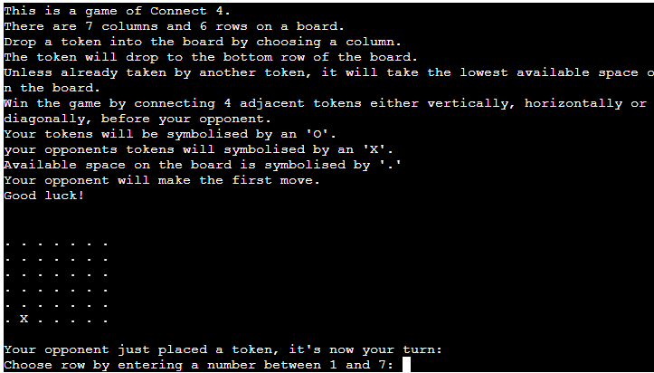
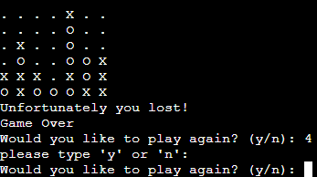

# Connect-4

This is a simple connect 4 game that pits the user against AI in a battle to connect 4 tokens either horizontally, vertically or diagonally. The game is programmed entirely of vanilla Python code and runs entirely in the terminal. 

## How To Play

There are 7 columns and 6 rows on a board.
Each player drops a token into the board by choosing a column.
The token will drop to the bottom row of the board.
Unless already taken by another token, it will take the lowest available space on the board.
Win the game by connecting 4 adjacent tokens either vertically, horizontally or diagonally, before the opponent.
The user player's tokens will be symbolised by an 'O'.
The opponents tokens will symbolised by an 'X'.
The opponent is currently played by a simple AI that chooses random rows.
Available space on the board is symbolised by '.'.
The AI opponent will make the first move.
    

## Features

* The game has the AI randomly select a token in which to drop a token.
* A function checks to verify the available space on the game board.
* User feedback is given through the game.
* Incorrect user input will be rejected and the user will be given further feedback. You must only enter numbers between 1 and 7.

## Issues/ Bugs

* There are instances currently where the game is won by either side when not connecting four tokens directly in a row, as the game grid edges are not bound.

Example: if row 2 has columns 1,2,3 and 7 with the same token it currently counts as a win, as shown in the below image.

I am aware of this issue and tried my best to troubleshoot before deadline but unfortunately did not have enough time to do so.

## Future Features

* The ability for the game to be played by two users instead of against AI.
* Update to the algorithm for the AI to increase difficulty as it currently chooses a random row.
* The ability to track statistics such as games won, turns taken to win etc.
* Allow players to increase grid size, amount of tokens that need to be connected, choose token symbols.
* Create classes in the code which would remove repeated functions for user and AI.

## Testing

* The code passed through the Code Institute Python Linter with just one error, which is caused by the use of Try, Except - to be fixed in future.
* The game is working as intended bar the one issue which is highlighted in the above section.

## Deployment

* This project was deployed using Code Institue's Python project template on Github.
* The application was deployed using Heroku by linking to the GitHub repository.
* Heroku buildpacks used are Python and NodeJS.
* Config Vars used were "PORT" = "8000"

## Author
* All code was written by me, Jamie Collins Maher with no code copied directly from elsewhere.